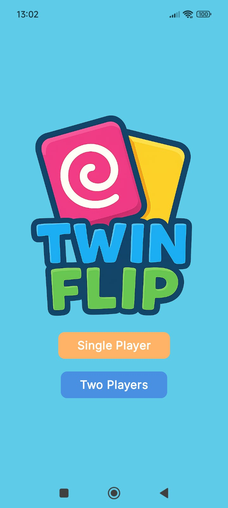
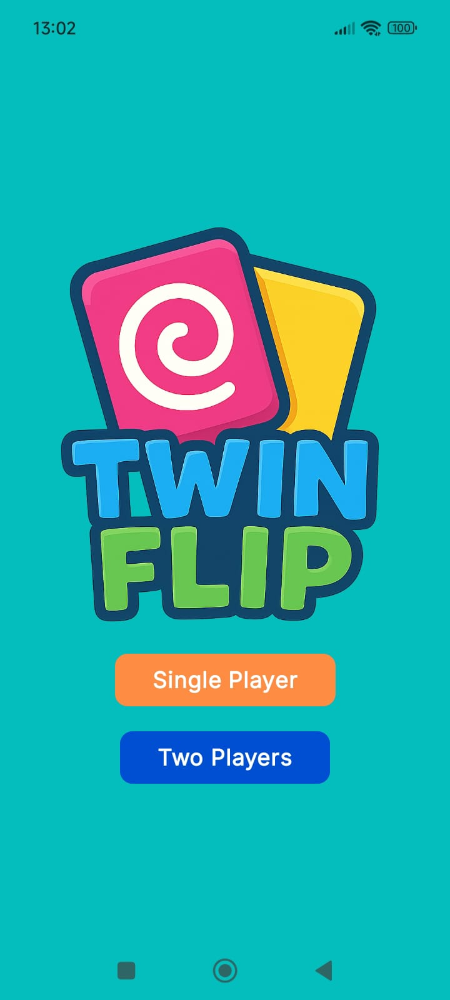
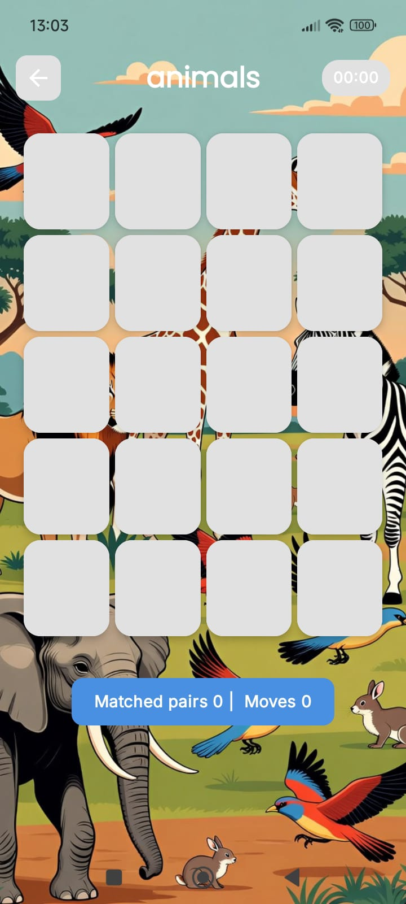
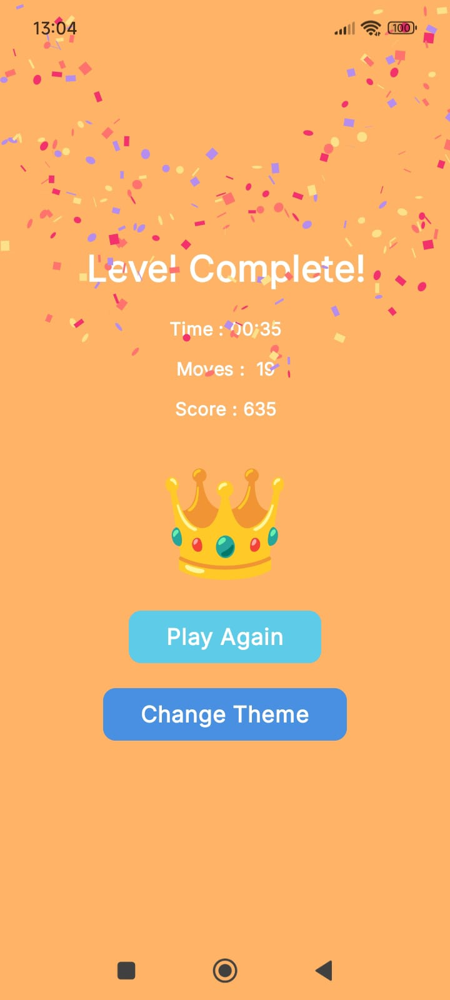
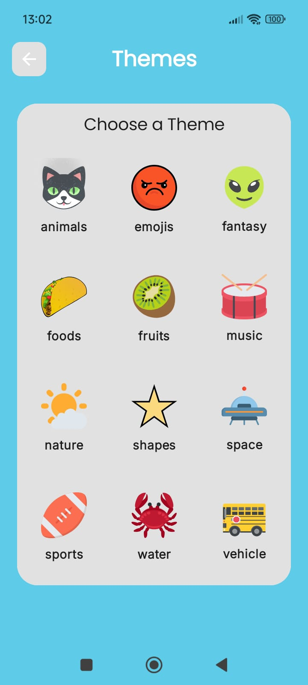
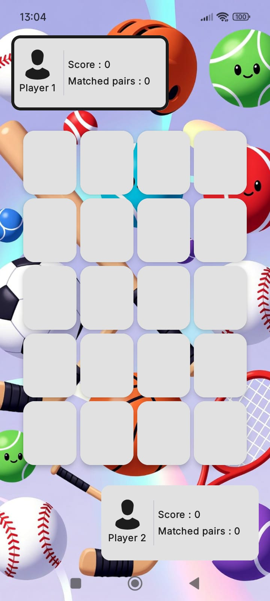
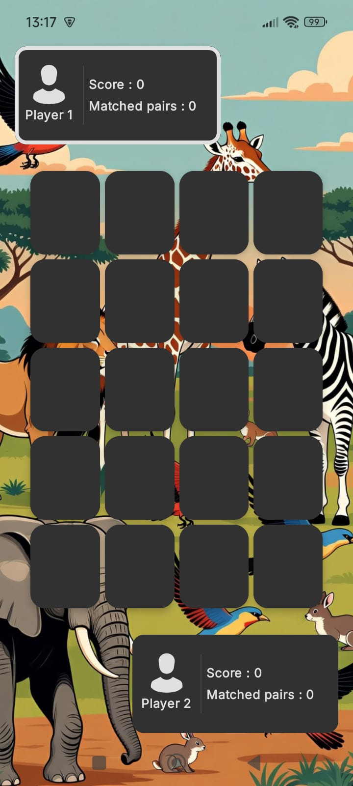
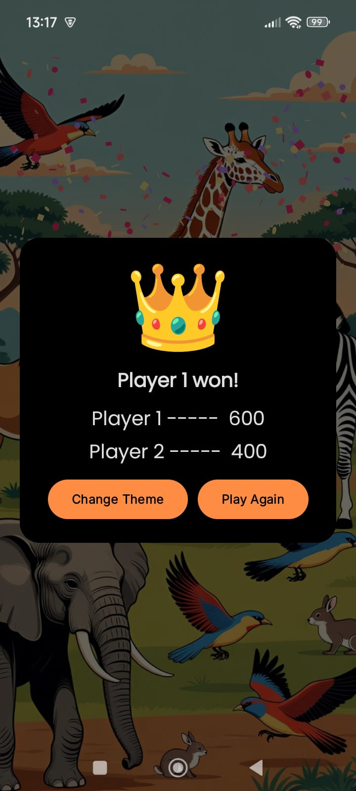

#  🎮 TwinFlip – Memory Card Game

TwinFlip is a modern Android memory card game built with Kotlin, Jetpack Compose, and MVVM architecture.
It features both Single Player and Multiplayer modes, dynamic themes, smooth animations, sound effects, and engaging gameplay mechanics.
___
# ✨ Features
## 🧠 Single Player Mode

- Countdown timer

- Move counter

- Multiple themes with unique background images

- Sound effects and background music

## 👥 Multiplayer Mode

- Real-time competitive gameplay

- Shared board state

- Match tracking per player

- Dynamic win detection

- Celebration screen on completion

## 🎨 Themes

Each theme includes:

* Custom card images

* Unique background image

* Themed visual style

Available themes:

 * Animals
 * Emojis
 * Fantasy
 * Foods
 * Fruits
 * Music
 * Nature
 * Shapes
 * Space
 * Sports
 * Water 
 * Vehicle

## 📸 Screenshots

---
<p align="center">
  
  
  
  
</p>

<br/>

<p align="center">
  
  
  
  
</p>

---

## 🏗️ Architecture

```
app/
core/
feature_home/
feature_singleplayer/
feature_multiplayer/
```

---

## 🛠 Tech Stack

- Kotlin
- Jetpack Compose
- MVVM
- Media3 (ExoPlayer)
- SoundPool
____